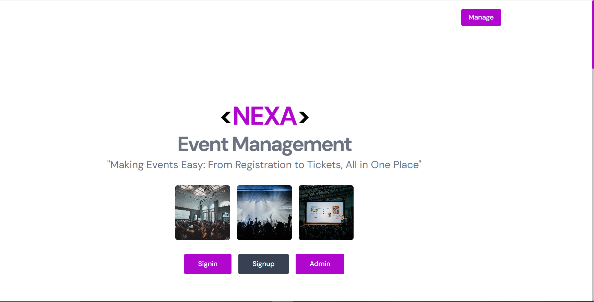

# NEXA
<h1 align="center"> NeXa | Networked Event eXperience Architecture</h1>
<h3 align="center">Live at comming soon......</h3>

## 📷 Landing Page 📷 

Welcome to our automated event management system, where you can easily organize events, manage registrations, and book tickets, all with just a few clicks. This system provides a hassle-free experience for both event organizers and attendees, making event management a breeze.
 

<h1>Features 🎯</h1>
<ul>
<li><strong>Event Creation:</strong> Create and customize events with ease.</li>
<li><strong>Registration Management:</strong> Allow attendees to register for events online.</li>
<li><strong>Ticket Booking:</strong> Enable attendees to book tickets for events online.</li>
<li><strong>Email Notifications:</strong> Send automated emails for event registrations and bookings, which are sent directly to attendees' email addresses.</li>
<li><strong>Attendee Tracking:</strong> Keep track of attendees and monitor check-in and check-out times.</li>
<li><strong>Admin Management:</strong> Product managers can add admins that can create and manage events.</li>
</ul>

<h1>Technologies Used</h1>
<ul>
<li><strong>Next.js:</strong> A React-based framework for building server-side rendered applications.</li>
<li><strong>Tailwind CSS:</strong> A utility-first CSS framework for building responsive and customizable user interfaces.</li>
<li><strong>JavaScript:</strong> A programming language used for client-side and server-side scripting.</li>
<li><strong>Node.js:</strong> A JavaScript runtime environment used for building scalable and efficient server-side applications.</li>
<li><strong>Express:</strong> A minimalist web framework for building server-side applications with Node.js.</li>
<li><strong>MongoDB:</strong> A NoSQL document-oriented database used for storing and retrieving data.</li>
</ul>

<h1>Architecture</h1>
Our event management system is built on a microservice architecture. This allows for scalability, flexibility, and efficient communication between different components of the system. The interactions between client and server take place via API calls, providing a seamless experience for both the organizers and attendees.
  
 
<h1>🚀 Getting Started (Locally)</h1>

<h3>Download or clone the repository</h3>

You can download the zip file of the repository or use the following command in your terminal to clone the repository:

<pre><code class="language-bash">git clone https://github.com/adarsh3002/NeXa.ai</code></pre>
<h3>Navigate to the project's root directory</h3>

Once you have downloaded or cloned the repository, navigate to the project's root directory. The project consists of three folders: client, server, and developer.

<h3>Install dependencies</h3>

Before starting the servers, make sure to install the dependencies by running the command:

<pre><code class="language-bash">npm install</code></pre>
<b>in all three folders: client, server, and developer.</b>
<h3>Set up environment variables</h3>

Before running the servers, you need to set up the following environment variables:

<h4>For the client-side:</h4>

Create a <b>.env.local</b> file in the client folder with the following variables:

<pre><code class="language-php">NEXT_PUBLIC_BASE_URL - the base URL of the API server (e.g. http://localhost:3000)
NEXT_PUBLIC_STRIPE_KEY - the public key for your Stripe account
NEXT_PUBLIC_API_URL - the URL of the API server (e.g. http://localhost:5000)</code></pre>
<h4>For the server-side:</h4>

Create a <b>.env</b> file in the server folder with the following variables:

<pre><code class="language-rust">MONGO_ATLAS_URI - the connection string for your MongoDB Atlas database
STRIPE_KEY - the secret key for your Stripe account
NODE_MAILER_USER - the email address to use for sending email notifications
NODE_MAILER_PASS - the password for the email address to use for sending email notifications
JWT_SECRET - the secret key to use for JWT token generation</code></pre>
<h3>Start the servers</h3>

To start the servers, run the following commands:

For the client-side:

<pre><code class="language-arduino">npm run dev</code></pre>

For the server-side:

<pre><code>nodemon index.js</code></pre>

For the developer-side:

<pre><code class="language-arduino">npm run dev</code></pre>
<h4>Note: Make sure to follow the exact steps mentioned above to avoid any errors or issues.</h4>
 

<h1>👉 How to use the site</h1>
Our event management system has three main components:

<ul>
  <li><strong>User:</strong> Users can sign in or sign up and access the user dashboard to view and register for events.</li>
  <li><strong>Admin:</strong> Admins can log in to create events, view their events, and manage registrations for their events.</li>
  <li><strong>Developer:</strong> Developers can access the developer site to create new admins (later this feature will be available only to product managers).</li>
</ul>

 
<h1>👥 Our Team</h1>
Our team consists of:

<ul>
  <li><strong>Adarsh Kumar:</strong>  
  Connect with Adarsh on 
  <a href="https://www.linkedin.com/in/adarsh-kumar-634740228/">
  LinkedIn
  </a> and 
  <a href="https://github.com/adarsh3002">
  GitHub
  </a>, or visit his 
  <a href="https://adarsh3002.github.io/Porfolio1/">
  Basic personal website
  </a>.
  </li>
  <li><strong>Abhinash Kumar:</strong>
  Connect with Abhinash on 
  <a href="https://www.linkedin.com/in/ak6744/">
  LinkedIn
  </a> and 
  <a href="https://github.com/aks057">
  GitHub
  </a>, or visit his 
  <a href="https://portfolio-jet-kappa-47.vercel.app/">
  personal website
  </a>.
  </li>

</ul>
 

<h1>🙌 Contributions</h1>
We welcome contributions to our project. If you have any suggestions or improvements, feel free to submit a pull request or open an issue.
 
 
